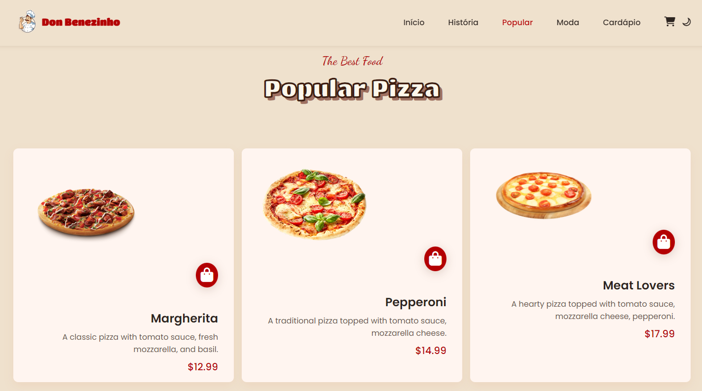
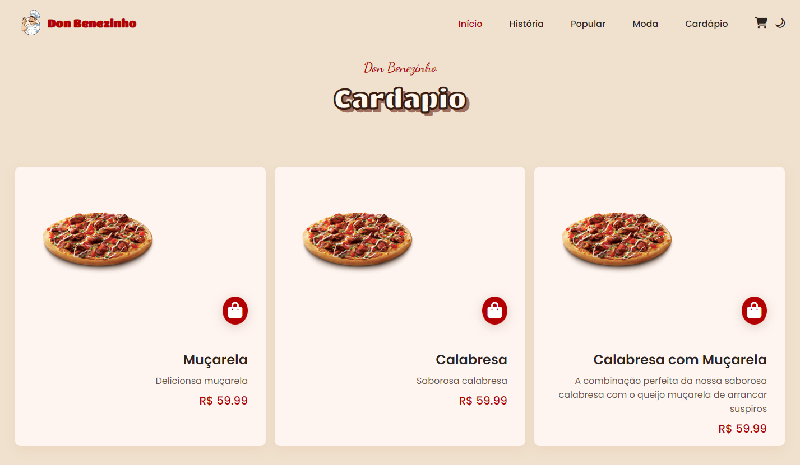
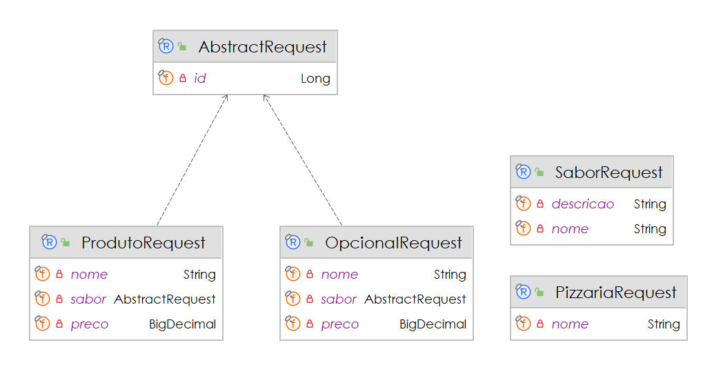
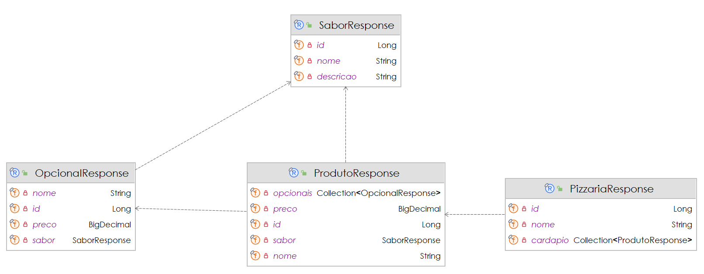

# 🍕 🤓👍🏽 Don Benezinho's Pizzaria

CP II - **Java Advanced** aplicado em 29/04/2024.

|                                            | **Java Advanced** |
|--------------------------------------------------------------------|-------------------|
| **ALUNO: Douglas Magalhães de Araújo e Gustavo Arguello Bertacci** | **TURMA:** 2TDSPF |
| **PROFESSOR:** Benefrancis do Nascimento                           | 29/04/2024        |
| **CP II**                                                          | ****              |

# Sumário

[Estudo de caso ](#_Estudo_de_caso)

[O que deverá ser feito? ](#_O_que_devera_ser_feito)

[Diagrama de Classes ](#_Diagrama_de_Classes)

[Como Entregar ](#_Entrega)

[Correção da Prova ](#_Correcao)

<a id="_Estudo_de_caso"></a>

# Estudo de caso

A Holding Benezinho está investindo no ramo da alimentação e por este motivo está desenvolvendo um site para seu
primeiro negócio no ramo. Trata-se do site da Rede de Pizzarias Benezinho's.

Com o objetivo de fazer este negócio dar certo, idealizamos o desenvolvimento de um Sistema de Gestão de Pizzarias e
produtos a
serem comercializados pelas lojas da rede.

Criaremos, nesta aula, um Produto Mínimo Viável (PMV) de uma API Rest para o sistema que alimentará, entre outras, as
telas exibidas abaixo:

## Início


## História


## Popular



## Moda


## Cardapio



Nossa equipe de design desenvolveu o layout e nossos Analistas de Sistemas e Arquitetos de Softwre desenvolveram os
Diagramas de Classes abaixo:

## Diagrama de Classes de Entidade


## Diagrama de Classes de Request (DTO's)



## Diagrama de Classes de Response (DTO's)



## Tecnologias utilizadas no projeto

1. Java
2. Spring Boot (Spring Data, Hateoas)
3. JPA, Hibernate
4. Relational Database
5. Templates Thymeleaf
6. HTML
7. CSS
8. JavaScript
9. Postman
10. Bean Validation

A sua missão aqui é realizar o Mapeamento Objeto
Relacional das classes de Entidade. Usaremos a JPA e o Hibernate como ferramentas de Mapeamento Objeto Relacional.

<a id="_O_que_devera_ser_feito"></a>

# O que deverá ser feito?

**Você deverá:**

**Fazer o fork do projeto do github.**:

[https://github.com/Benefrancis/cp2-2024-pf-pizzaria](https://github.com/Benefrancis/cp2-2024-pf-pizzaria)

Caso o github esteja indisponível, você deverá pegar o projeto no diretório compartilhado.

Alterar o arquivo contido em  **documentos/equipe.txt** para incluir os RMs e nomes e turma do trio que fará esta
atividade. Caso tenham recebido algum ponto por participação nas aulas informe neste arquivo. Não aceitarei de outra
forma ou reclamações posteriores.

**OBS:** Será com base nos nomes contidos neste aquivo que eu irei atribuir a nota.

1. **(2,5 Ponto)** O Mapeamento Objeto Relacional das primeiras classes envolvidas neste projeto de software (classes do
   pacote entity)
   essas classes deverão ser capazes de fazer a criação automatizada das tabelas no banco de dados Oracle, gerar
   constraints inteligíveis e não permitir redundância de informações importantes para o negócio;

    1. **(0,5 Ponto)** - **Sabor** - Sabores com nome repetido não devem ser aceitos
    2. **(0,5 Ponto)** - **Opcional** -Opcional com o Sabor e nome repetido não devem ser aceitos
    3. **(0,5 Ponto)** - **Produto** - Produtos com o Sabor e nome repetido não devem ser aceitos
    4. **(1 Ponto)** - **Pizzaria** - Pizzarias com o nome repetido não devem ser aceitos

2. **(1,5 Ponto)** A criação dos Seguintes DTOs (Objetos de Transferência de Dados) de Request e de Response:

    1. **(0,25 Ponto)** - **SaborRequest** e **SaborResponse**
    2. **(0,25 Ponto)** - **OpcionalRequest** e **OpcionalResponse**
    3. **(0,25 Ponto)** - **ProdutoRequest** e **ProdutoResponse**
    4. **(0,5 Ponto)** - **PizzariaRequest** e **PizzariaResponse**
    6. **(0,25 Ponto)** - **AbstractRequest**


3. **(1,5 Ponto)** A criação dos Seguintes Services que devem implementar a ServiceDTO (foi fornecida):

    1. **(0,25 Ponto)** - **SaborService**
    2. **(0,25 Ponto)** - **OpcionalService**
    3. **(0,5 Ponto)** - **ProdutoeService**
    4. **(0,5 Ponto)** - **PizzariaService**


4. **(5,5 Ponto)** A criação dos Seguintes Resources que devem implementar a ResourceDTO (foi fornecida):

    1. **SaborResource** com as seguintes ROTAS e VERBOS:
        1. **(0,25 Ponto)** "localhost/sabores" - **POST**
        2. **(0,5 Ponto)** "localhost/sabores" - **GET by Example**,
        3. **(0,25 Ponto)** "logalhost/sabores/{id}" - **GET**

    1. **OpcionalResource** com as seguintes ROTAS e VERBOS:
        1. **(0,25 Ponto)** "localhost/opcionais" - **POST**
        2. **(0,5 Ponto)** "localhost/opcionais" - **GET by Example**,
        3. **(0,25 Ponto)** "logalhost/opcionais/{id}" - **GET**

    2. **ProdutoResource** com as seguintes ROTAS e VERBOS: 1,75
        1. **(0,25 Ponto)** "localhost/produtos" - **POST**
        2. **(0,5 Ponto)** "localhost/produtos" - **GET by Example**,
        3. **(0,25 Ponto)** "logalhost/produtos/{id} - **GET**
        4. **(0,5 Ponto)** "logalhost/produtos/{id}/opcionais" - **POST**
        5. **(0,25 Ponto)** "logalhost/produtos/{id}/opcionais" - **GET**

    3. **PizzariaResource** com as seguintes ROTAS e VERBOS:17,75
        1. **(0,25 Ponto)** "localhost/pizzarias" - **POST**
        2. **(0,5 Ponto)** "localhost/pizzarias" - **GET by Example**,
        3. **(0,25 Ponto)** "logalhost/pizzarias/{id} - **GET**
        3. **(0,5 Ponto)**"logalhost/pizzarias/{id}/cardapio" - **POST**
        4. **(0,25 Ponto)** "logalhost/pizzarias/{id}/cardapio" - **GET**


5. **(2 PONTOS)** - Execução dos Testes com o **POSTMAN**:
   A dupla deverá criar e executar os testes no POSTMAN para todos os endpoints da aplicação, exportar os testes e
   colocar na pasta documentação/requisições. Receberá os pontos se o arquivo for fornecido e os testes realmente forem
   eficazes.

<a id="_Entrega"></a>

# Como Entregar

**A entrega deverá ser feita pelo Teams**, você deverá postar o arquivo compactado do projeto contendo todos os
artefatos (receberá nota ZERO o aluno que postar apenas o link para o github). Porém não se esqueça
de fazer o **commit** e **push** do projeto no github.

**ATENÇÃO ---- MUITA ATENÇÃO**
**Não será aceito para correção o link para o projeto no github**. O aluno que entregar apenas o link receberá nota
**ZERO**

<a id="_Correcao"></a>

# Correção da Prova

Nos próximos dias, a correção da prova será disponibilizada no github do professor (branch correcao):

Para acessar digite no prompt:

```shell
git clone https://github.com/Benefrancis/cp2-2024-pf-pizzaria && cd cp2-2024-pf-pizzaria && git checkout correcao
```

A avaliação é em trio ( devido a grande quantidade de coisas para fazer Desenvolvimento, ORM, Testes e Documentação).

**Não copie, não forneça e nem aceite o código de outro aluno.**
O professor acessará o log do github e outras fontes para ver se a avaliação foi fraudada.
Caso o arquivo compactado não tenha o log igual ao do github, a dupla receberá nota **ZERO**
Em caso de fraude **de qualquer tipo** à atividade avaliativa, todos os envolvidos receberão nota **ZERO**

Boa avaliação.
